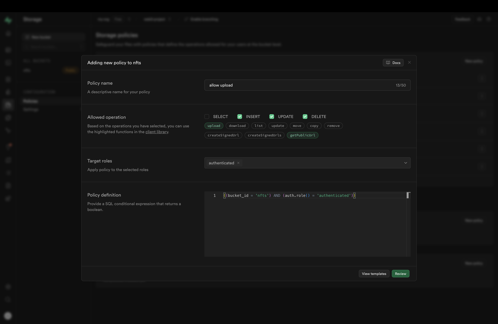

# nftFolio
A simple web app to create, manage, and find digital assets (Simulated blockchain).

# Tech stack
- Next.js
- Tailwind CSS
- Fastify
- tRPC
- Supabase
- Drizzle
- Turborepo

# Features
- Create a new digital asset
- List all digital assets
- View a digital asset
- Transfer a digital asset
- Explore and search digital assets

# Local development

## Prerequisites
- Node.js
- pnpm

## Setup
1. Clone the repository
```bash
git clone https://github.com/asrvd/nftFolio.git
```

2. Setup supabase project
- Create a new project on [Supabase](https://supabase.com/)
- Head over to project settings and get the following ENV variables
  - `NEXT_PUBLIC_SUPABASE_URL` under Settings > API
  - `NEXT_PUBLIC_SUPABASE_ANON_KEY` under Settings > API
  - `DATABASE_URL` under Settings > Database
- Create a new storage bucket named `nfts`, make it public
- Add following RLS policies to the `nfts` bucket, make sure you selected `Authenticated` in target roles, and `INSERT`, `UPDATE`, `DELETE` from allowed operations

```sql
((bucket_id = 'nfts') AND (auth.role() = 'authenticated'))
```
- Now head over to SQL editor and run the following SQL script, this creates a new public table `profiles` and a trigger function `handle_new_user` to copy user data from `auth.users` table to `profiles` table every time a new user is created since we can't directly access `auth.users` table
```sql
-- create a table to copy user data from supabase's auth.users table
create table public.profiles (
  id uuid not null references auth.users on delete cascade,
  email text not null unique,

  primary key (id)
);

-- inserts a row into public.profiles
create function public.handle_new_user()
returns trigger
language plpgsql
security definer set search_path = ''
as $$
begin
  insert into public.profiles (id, email)
  on conflict (id) do nothing;  -- do nothing if the user already exists
  values (new.id, new.email);
  return new;
end;
$$;

-- trigger the function every time a user is created
create trigger on_auth_user_created
  after insert on auth.users
  for each row execute procedure public.handle_new_user();
```
- Create a new discord application by visiting [Discord Developer Portal](https://discord.com/developers/applications), and get the client ID and client secret
- Head over to your Supbase project dashboard, under Authentication > Providers, enable Discord and fill in the client ID and client secret
- Copy the Callback URL from the Discord provider settings and add it to the Discord application settings under OAuth2 > Redirects

3. Setup environment variables
- Create env files under `app/web` and `app/api` directories following the schema in `.env.example` files
```bash
# app/web/.env
NEXT_PUBLIC_SUPABASE_URL=<supabase_url>
NEXT_PUBLIC_SUPABASE_ANON_KEY=<supabase_anon_key>
DATABASE_URL=<supabase_database_url>

# app/api/.env
SUPABASE_URL=<supabase_url>
SUPABASE_ANON_KEY=<supabase_anon_key>
DATABASE_URL=<supabase_database_url>
```

4. Install dependencies
```bash
pnpm install
```

5. Run the development server
```bash
pnpm dev
```